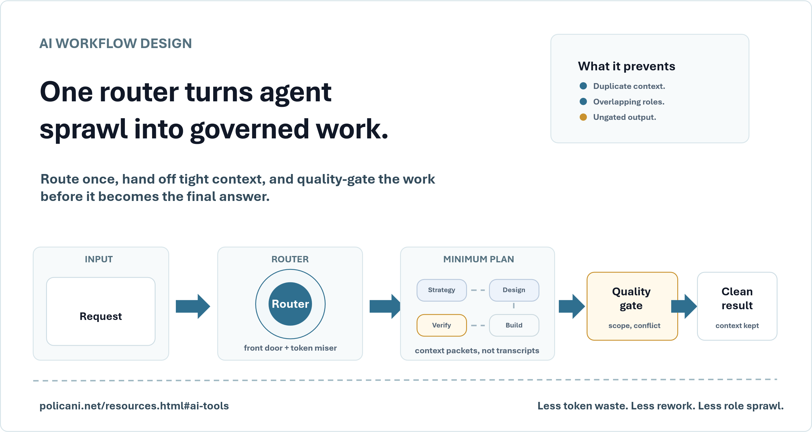
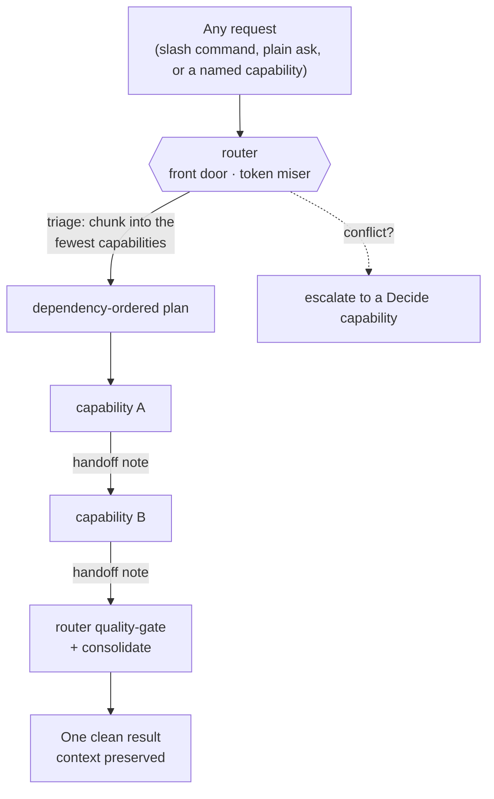
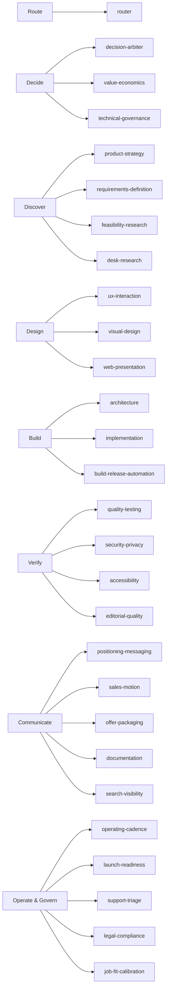

# Subagent Operating Model

**A router-first, capability-based operating model for AI subagents — built for Codex (GPT) and Claude Code / Cowork.**



One router sits in front of every request. It triages the ask, chunks it into the *fewest* expert capabilities that still protect the final state, holds the dependency order, passes compact state packets, gates quality between steps, and hands back a single clean result with the important state preserved. It exists to kill the three things that quietly wreck multi-agent setups: **token waste, duplicated rework, and role sprawl.**

> **Status:** Public reference implementation (v1). Plain Markdown for Claude Code / Cowork, TOML for Codex. No build step, no dependencies, no API keys. Copy the folder and go.

---

## Why a subagent operating model

Spinning up "agents for everything" feels productive and usually isn't. The common failure modes:

- **Token burn.** Each agent re-reads the whole conversation, re-explains context, and re-reviews work that was already fine.
- **Rework and drift.** Two agents touch the same artifact, contradict each other, and someone has to reconcile them.
- **Role sprawl.** You end up with a cast of "CEO / CTO / Head of Everything" agents whose scopes overlap and whose names don't tell you what they actually do.

This model fixes that with one idea: **a single router is the front door, and everything else is a narrow capability — defined by what it does, not by a job title.**

## How it works



Every request — even one that names a single capability — passes through the router first. For a simple ask the router does a fast, cheap pass and routes to one capability. For complex work it builds a dependency-ordered plan, passes each capability a tight **state packet** (not the whole transcript), gates each result before it flows downstream, then merges everything into one answer.

## The capabilities: 8 buckets, 28 narrow roles

Capabilities are grouped into human-readable **buckets** so you can see which family of work is firing and where to optimize.



| Bucket | What it owns | Capabilities |
|---|---|---|
| **Route** | Triage, routing, consolidation | `router` |
| **Decide** | Tradeoffs, money, tech direction | `decision-arbiter` · `value-economics` · `technical-governance` |
| **Discover** | Strategy, requirements, research | `product-strategy` · `requirements-definition` · `feasibility-research` · `desk-research` |
| **Design** | Flow, visuals, web polish | `ux-interaction` · `visual-design` · `web-presentation` |
| **Build** | Architecture, code, release automation | `architecture` · `implementation` · `build-release-automation` |
| **Verify** | Testing, security, accessibility, editing | `quality-testing` · `security-privacy` · `accessibility` · `editorial-quality` |
| **Communicate** | Positioning, sales, docs, SEO | `positioning-messaging` · `sales-motion` · `offer-packaging` · `documentation` · `search-visibility` |
| **Operate & Govern** | Cadence, launch, support, legal, hiring fit | `operating-cadence` · `launch-readiness` · `support-triage` · `legal-compliance` · `job-fit-calibration` |

No standing CEO/CTO/COO agents. Their real *capabilities* live as `decision-arbiter`, `value-economics`, and `technical-governance` — and a built-in **legacy alias map** means you can still type "as marketing" or "have the CTO review this" and the router maps it to the right capability.

## Use cases

- **Ship a feature without a swarm.** "Turn this rough idea into a built, documented change" → router may run `requirements-definition -> documentation preflight -> architecture -> implementation -> quality-testing -> documentation`, in order, once each.
- **Tighten public copy.** "Rewrite this landing page and make it findable" → `positioning-messaging → editorial-quality → search-visibility`, nothing repeated.
- **De-risk a decision.** "Is this worth building?" → `product-strategy` and `value-economics` feed `decision-arbiter`; the router escalates the conflict instead of guessing.
- **One-capability asks stay cheap.** "Proofread this" routes straight to `editorial-quality` with a one-line triage — no orchestration tax.

## Final-state discipline

The model treats each capability as a **state improver**, not just an artifact
finisher. A capability's visible output is only the edge of its real job. The
router should involve a capability early when its expertise can prevent rework,
not only after an artifact exists.

Every capability can operate in three modes:

- **Preflight:** inspect intent, constraints, risks, user/customer lens, and
  handoff readiness before work hardens.
- **Production:** create or change the assigned artifact inside the approved
  scope.
- **Verification:** judge whether the result meets the capability's standard
  and name what still blocks a good final state.

Context packets become **state packets** for complex work. They should preserve
goal, artifact, constraints, prior decisions, open decisions, assumptions,
evidence available, evidence gaps, downstream consumer, stop gate, and what the
capability may challenge. Source facts, assumptions, decisions,
recommendations, risks, measurement signals, and implementation tasks are
different objects; the router and capabilities must not collapse them into one
undifferentiated summary.

## Ownership gates

For public-facing pages, the router separates **voice** from
**discoverability**. `positioning-messaging` owns visible page copy, section
labels, CTAs, and message hierarchy. `search-visibility` owns metadata,
structured data, canonical/crawler signals, social previews, sitemaps, and
machine-facing summaries such as `llms.txt`.

Search can recommend query language, but it cannot put SEO or answer-engine
scaffolding into rendered page copy. The default chain for public page work is
`positioning-messaging -> editorial-quality -> search-visibility -> implementation`.

Public pages also separate **reader-facing confidence** from internal evidence
handling. Visible copy should explain what the reader can evaluate, not expose
source-lineage notes, audit caveats, privacy rationale, SEO rationale,
answer-engine strategy, prompt/tool limitations, or defensive legal/security
language. Put those details in metadata, proof-boundary pages, documentation,
or private review context unless the artifact is explicitly about proof,
methodology, legal/security, docs, or SEO.

The same rule applies anywhere capabilities can collide:

- `ux-interaction` owns flow; `visual-design` owns the visual system;
  `web-presentation` owns browser polish; `accessibility` owns inclusive-use
  constraints; `implementation` preserves those decisions while coding.
- `product-strategy` owns whether and why; `requirements-definition` owns
  accepted scope; `architecture` owns solution shape; `implementation` owns the
  code change.
- `technical-governance` owns platform standards and technology risk;
  `architecture` owns the selected design; `implementation` executes inside it.
- `security-privacy` owns data and exposure risk; `legal-compliance` owns
  policy, licensing, IP, privacy, and claims; `documentation` communicates only
  approved behavior and boundaries.
- `quality-testing` owns verification; `build-release-automation` owns
  repeatable packaging/deploy mechanics; `launch-readiness` owns go/no-go,
  rollback, and cutover.
- `support-triage` owns user issue classification and escalation signals;
  `implementation` owns accepted fixes; `documentation` owns verified help
  content; `product-strategy` owns roadmap changes from repeated signals.

Interchange rules should be designed per role pair. A few common patterns:

- Requirements to documentation: explainability, terminology, and user mental
  model are checked before implementation.
- UX to documentation: task flow, labels, and user-facing language stay aligned.
- Support to product: repeated pain becomes evidence, not an automatic roadmap
  commitment.
- Security to implementation: required fixes, accepted risks, and open exposure
  are kept separate.
- Search to positioning: query language can inform visible copy, but voice and
  persuasion stay with positioning.
- Quality testing to launch readiness: passing tests is evidence for release,
  not release approval by itself.

This is the core lesson: a subagent that only finishes its artifact will often
miss the failure it exists to prevent.

## Quick start

**Claude Code / Cowork**

```text
cowork/
  CLAUDE.md        # the operating model (router, buckets, token rules)
  router.md        # the front door
  <capability>.md  # 27 narrow capabilities
```

Point your assistant at `cowork/CLAUDE.md`, then drive it in plain language: `/subagent <request>`, `/agent <request>`, `@router`, or just name a capability ("as positioning-messaging ..."). The router triages from there.

**Codex (GPT)**

```text
codex/
  AGENTS.md                  # the operating model (mirrors CLAUDE.md)
  CLAUDE.md                  # identical copy
  .codex/agents/*.toml       # router + 27 capabilities, each with model + tools
```

Drop `.codex/agents/` into your Codex project. Invoke the `router` agent (`--agent router`) or describe the goal in prose — Codex matches the capability from its keywords.

## What makes it token-aware

- **Minimum assignment.** Default to one capability; add another only when it protects the final state with a genuinely different gate.
- **State packets, not transcripts.** Each capability gets the smallest useful packet: goal, artifact path, constraints, prior decisions, open decisions, evidence gaps, downstream consumer, the specific question, and the stop gate.
- **No-rework rule.** Validated work is never redone; only deltas move forward.
- **Quality gate + single consolidation.** The router merges once; capabilities never repeat each other.

## How to evaluate this repo (2 minutes)

1. Read `cowork/CLAUDE.md` (or `codex/AGENTS.md`) — the whole operating model is one file.
2. Open `cowork/router.md` to see the front-door logic.
3. Skim two capability files (e.g. `cowork/implementation.md`, `cowork/positioning-messaging.md`) to see the consistent shape: focus → router contract → required inputs → token discipline → scope boundaries → handoff format.
4. See `examples/routing-walkthrough.md` for one request routed end to end.

## Maintainer note

This package is the general-use version of the operating model. It should stay
operator-neutral: no personal portfolio copy, private project context, employer
details, or identity-specific routing assumptions inside the reusable engine.

## License

Code and configuration are licensed under **MIT**. Documentation and examples are licensed under **CC BY 4.0** with attribution to Marco Policani. See [`LICENSE.md`](LICENSE.md).

---

*Keywords: AI subagents, Claude Code subagents, Codex agents, multi-agent orchestration, agent router, capability-based agents, AI agent operating model, token optimization, AI workflow governance, Claude Agent SDK, Cowork subagents.*
