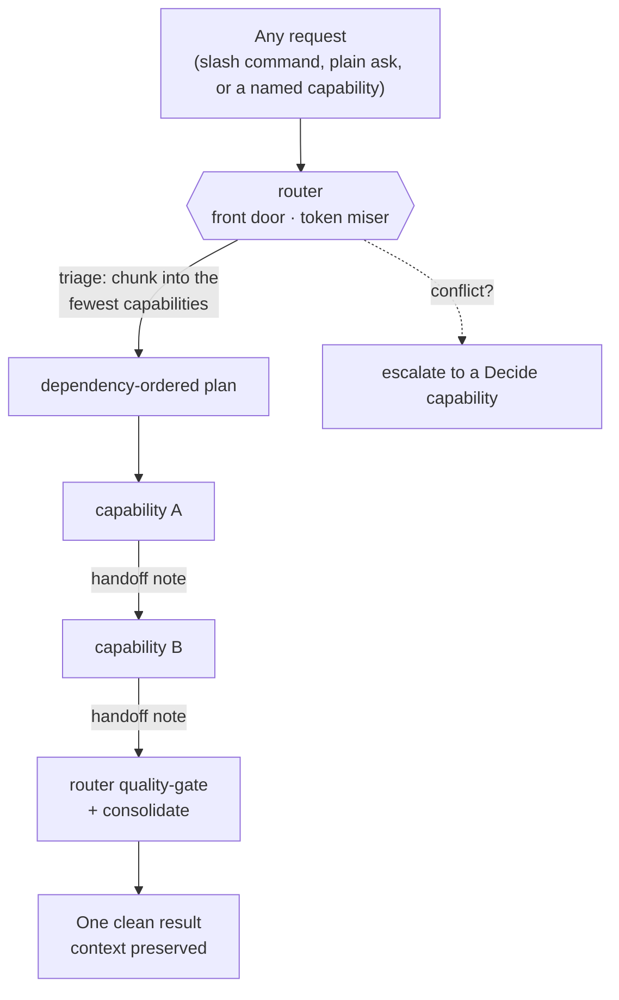
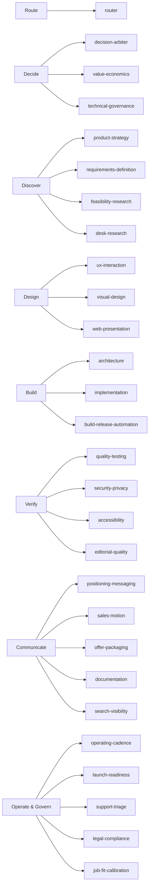

# Subagent Operating Model

**A router-first, capability-based operating model for AI subagents — built for Codex (GPT) and Claude Code / Cowork.**

One router sits in front of every request. It triages the ask, chunks it into the *fewest* expert capabilities that can actually cover it, holds the dependency order, gates quality between steps, and hands back a single clean result with context preserved. It exists to kill the three things that quietly wreck multi-agent setups: **token waste, duplicated rework, and role sprawl.**

> **Status:** Public reference implementation (v1). Plain Markdown for Claude Code / Cowork, TOML for Codex. No build step, no dependencies, no API keys. Copy the folder and go.

---

## Why a subagent operating model

Spinning up "agents for everything" feels productive and usually isn't. The common failure modes:

- **Token burn.** Each agent re-reads the whole conversation, re-explains context, and re-reviews work that was already fine.
- **Rework and drift.** Two agents touch the same artifact, contradict each other, and someone has to reconcile them.
- **Role sprawl.** You end up with a cast of "CEO / CTO / Head of Everything" agents whose scopes overlap and whose names don't tell you what they actually do.

This model fixes that with one idea: **a single router is the front door, and everything else is a narrow capability — defined by what it does, not by a job title.**

## How it works



Every request — even one that names a single capability — passes through the router first. For a simple ask the router does a fast, cheap pass and routes to one capability. For complex work it builds a dependency-ordered plan, passes each capability a tight **context packet** (not the whole transcript), gates each result before it flows downstream, then merges everything into one answer.

## The capabilities: 8 buckets, 28 narrow roles

Capabilities are grouped into human-readable **buckets** so you can see which family of work is firing and where to optimize.



| Bucket | What it owns | Capabilities |
|---|---|---|
| **Route** | Triage, routing, consolidation | `router` |
| **Decide** | Tradeoffs, money, tech direction | `decision-arbiter` · `value-economics` · `technical-governance` |
| **Discover** | Strategy, requirements, research | `product-strategy` · `requirements-definition` · `feasibility-research` · `desk-research` |
| **Design** | Flow, visuals, web polish | `ux-interaction` · `visual-design` · `web-presentation` |
| **Build** | Architecture, code, release automation | `architecture` · `implementation` · `build-release-automation` |
| **Verify** | Testing, security, accessibility, editing | `quality-testing` · `security-privacy` · `accessibility` · `editorial-quality` |
| **Communicate** | Positioning, sales, docs, SEO | `positioning-messaging` · `sales-motion` · `offer-packaging` · `documentation` · `search-visibility` |
| **Operate & Govern** | Cadence, launch, support, legal, hiring fit | `operating-cadence` · `launch-readiness` · `support-triage` · `legal-compliance` · `job-fit-calibration` |

No standing CEO/CTO/COO agents. Their real *capabilities* live as `decision-arbiter`, `value-economics`, and `technical-governance` — and a built-in **legacy alias map** means you can still type "as marketing" or "have the CTO review this" and the router maps it to the right capability.

## Use cases

- **Ship a feature without a swarm.** "Turn this rough idea into a built, documented change" → router runs `requirements-definition → architecture → implementation → quality-testing → documentation`, in order, once each.
- **Tighten public copy.** "Rewrite this landing page and make it findable" → `positioning-messaging → editorial-quality → search-visibility`, nothing repeated.
- **De-risk a decision.** "Is this worth building?" → `product-strategy` and `value-economics` feed `decision-arbiter`; the router escalates the conflict instead of guessing.
- **One-capability asks stay cheap.** "Proofread this" routes straight to `editorial-quality` with a one-line triage — no orchestration tax.

## Quick start

**Claude Code / Cowork**

```text
cowork/
  CLAUDE.md        # the operating model (router, buckets, token rules)
  router.md        # the front door
  <capability>.md  # 27 narrow capabilities
```

Point your assistant at `cowork/CLAUDE.md`, then drive it in plain language: `/subagent <request>`, `/agent <request>`, `@router`, or just name a capability ("as positioning-messaging ..."). The router triages from there.

**Codex (GPT)**

```text
codex/
  AGENTS.md                  # the operating model (mirrors CLAUDE.md)
  CLAUDE.md                  # identical copy
  .codex/agents/*.toml       # router + 27 capabilities, each with model + tools
```

Drop `.codex/agents/` into your Codex project. Invoke the `router` agent (`--agent router`) or describe the goal in prose — Codex matches the capability from its keywords.

## What makes it token-aware

- **Minimum assignment.** Default to one capability; add another only for a genuinely different gate.
- **Context packets, not transcripts.** Each capability gets goal + artifact path + constraints + the one question — referenced by name, not re-pasted.
- **No-rework rule.** Validated work is never redone; only deltas move forward.
- **Quality gate + single consolidation.** The router merges once; capabilities never repeat each other.

## How to evaluate this repo (2 minutes)

1. Read `cowork/CLAUDE.md` (or `codex/AGENTS.md`) — the whole operating model is one file.
2. Open `cowork/router.md` to see the front-door logic.
3. Skim two capability files (e.g. `cowork/implementation.md`, `cowork/positioning-messaging.md`) to see the consistent shape: focus → router contract → required inputs → token discipline → scope boundaries → handoff format.
4. See `examples/routing-walkthrough.md` for one request routed end to end.

## Who built this

Built by **Marco Policani** — a Director / Principal-level portfolio, PMO, and AI operating-systems leader. This kit is one of several public proofs of how I design AI-assisted operating systems: **evidence-bound, governance-first, and token-aware**, with human judgment owning the decisions.

If you're a hiring manager or team lead evaluating that kind of work, this repo is a working sample of it — and there's more.

➡️ **Explore the full portfolio, case studies, and other operating tools at [policani.net](https://policani.net).**

## License

Code and configuration are licensed under **MIT**. Documentation and examples are licensed under **CC BY 4.0** with attribution to Marco Policani. See [`LICENSE.md`](LICENSE.md).

---

*Keywords: AI subagents, Claude Code subagents, Codex agents, multi-agent orchestration, agent router, capability-based agents, AI agent operating model, token optimization, AI workflow governance, Claude Agent SDK, Cowork subagents.*
