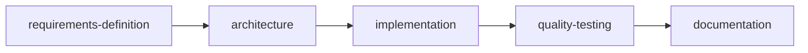

# Routing walkthrough

One request, routed end to end. This shows the router doing its job: minimum
assignment, dependency order, quality gate, single consolidation. All content
here is generic and illustrative.

---

**Operator request:** "Take this rough idea for a config-export feature and turn
it into a built, tested, documented change."

## Router triage

> Restated: produce a shippable, documented feature from a rough idea.
> Desired output: working change + tests + docs.
> This is multi-step. Assignment budget: 5 capabilities, in dependency order.



The router does **not** fan out in parallel and does **not** pull in extra
capabilities (no `visual-design`, no `sales-motion` — they don't apply).

## Step 1 — requirements-definition

```
Inputs received: rough idea, target user, goal
Findings: in-scope = export current config as JSON + re-import; out-of-scope = cloud sync
Risks: "config" shape is undefined
Recommendations: 4 acceptance criteria (listed)
Next-capability handoff: architecture, with the acceptance criteria
```

## Step 2 — architecture

```
Inputs received: acceptance criteria
Findings: one-function export/import; versioned schema; no new dependencies
Risks: schema drift between versions
Recommendations: add a version field; define the interface
Next-capability handoff: implementation, with the interface + version rule
```

## Step 3 — implementation

```
Inputs received: interface + acceptance criteria
Findings: implemented export(), import(), version guard
Risks: none beyond tested paths
Next-capability handoff: quality-testing, with the change + acceptance criteria
```

## Step 4 — quality-testing

```
Inputs received: change + acceptance criteria
Findings: 4/4 criteria pass; added round-trip + bad-version edge cases
Risks: none blocking
Next-capability handoff: documentation
```

The router **quality-gates** here: if a criterion had failed, it would bounce the
work back to `implementation` with a delta note — not forward to docs.

## Step 5 — documentation

```
Inputs received: final change
Findings: documented the JSON fields, the version rule, and a usage snippet
Next-capability handoff: back to router for consolidation
```

## Router consolidation (what the operator sees)

> **Done:** config export/import feature shipped.
> **Decisions:** versioned JSON schema, no new dependencies.
> **Tested:** 4/4 acceptance criteria + round-trip + bad-version edge cases.
> **Docs:** fields, version rule, usage snippet.
> **Carry-forward:** if a future version changes the schema, run `architecture`
> on the migration before `implementation`.

Five capabilities, each used once, in order, with context preserved — and one
clean result handed back.
